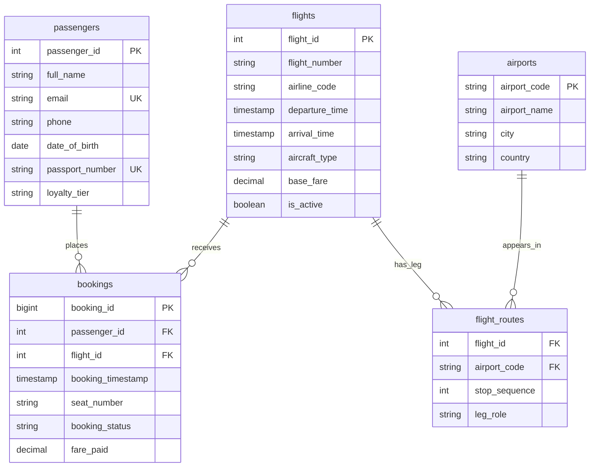

# ex603-airline-booking-database

# Skyline Reservations — Airline Booking Database

A relational database modeling an airline's main booking platform: passengers, flights, the airports they connect, and the bookings that bring them together.

**Theme:** Airline Booking (Theme 5)

## The Domain

This project models the data layer behind an airline booking platform, the part of the system responsible for knowing who has booked what, on which flight, through which airports, and for how much. The platform needs to answer questions at two very different scales:("what does this passenger's booking history look like?", "is this flight still active and bookable?") and questions across potentially millions of rows ("what's total revenue by route this quarter?", "which airports see the most connecting traffic?"). The schema is designed so both kinds of question are answerable without restructuring the data — a fast, well-indexed fact table (`bookings`) sits at the center, with the slower-changing reference data (`passengers`, `flights`, `airports`) around it.

Two things make airline data more interesting than a basic one-flight-one-booking model: fares are dynamic, and itineraries are not always a single hop. A passenger's `fare_paid` on a given booking can legitimately differ from a flight's advertised `base_fare` because of discounts, timing, and loyalty status, so those two numbers are stored separately rather than assumed to be the same value. And a single flight can touch more than two airports, which is why airports and flights are connected through a genuine many-to-many junction (`flight_routes`) rather than a pair of "origin airport" / "destination airport" columns bolted directly onto `flights`.

The questions this platform ultimately needs to support include: which flights are available between two airports on a given date and under a given price; what is a specific passenger's full booking and travel history; which flights or routes generate the most revenue or the most cancellations;. Unit 1 shows the schema, constraints, and ERD that make those questions answerable...

## Schema (ERD)

Five roles: `passengers` (actor), `flights` (producer), `bookings` (event/fact table), `airports` (catalog), and `flight_routes` (junction). Full attribute-level detail, domains, and primary keys are in [`schema/schema-definition.md`](schema/schema-definition.md); every constraint and its `ON DELETE` justification is in [`schema/constraints.md`](schema/constraints.md).

Note: Mermaid's ER notation only allows one key tag per attribute, so `flight_routes.flight_id` and `flight_routes.airport_code` are both shown as `FK` below — together they form the table's composite primary key (see `constraints.md` for the full explanation).

