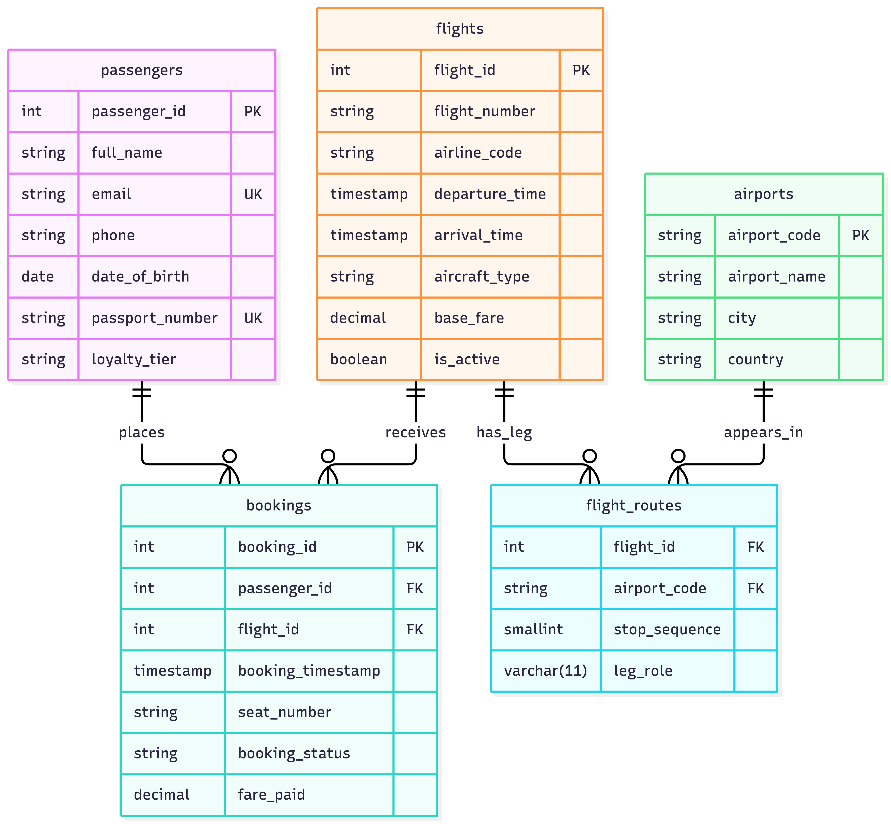
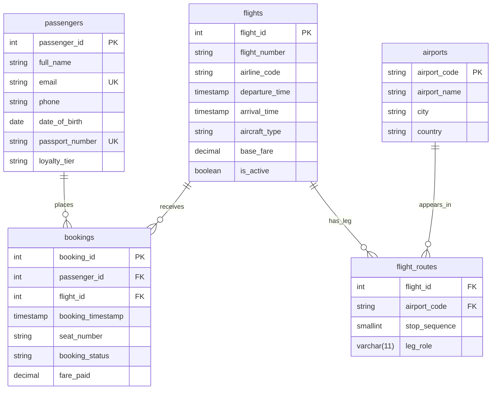

# ex603-airline-booking-database

# Skyline Reservations — Airline Booking Database

A relational database modeling an airline's main booking platform: passengers, flights, the airports they connect, and the bookings that bring them together.

**Theme:** Airline Booking (Theme 5)

## The Domain

This project models the data layer behind an airline booking platform, the part of the system responsible for knowing who has booked what, on which flight, through which airports, and for how much. The platform needs to answer questions at two very different scales:("what does this passenger's booking history look like?", "is this flight still active and bookable?") and questions across potentially millions of rows ("what's total revenue by route this quarter?", "which airports see the most connecting traffic?"). The schema is designed so both kinds of question are answerable without restructuring the data — a fast, well-indexed fact table (`bookings`) sits at the center, with the slower-changing reference data (`passengers`, `flights`, `airports`) around it.

Two things make airline data more interesting than a basic one-flight-one-booking model: fares are dynamic, and itineraries are not always a single hop. A passenger's `fare_paid` on a given booking can legitimately differ from a flight's advertised `base_fare` because of discounts, timing, and loyalty status, so those two numbers are stored separately rather than assumed to be the same value. And a single flight can touch more than two airports, which is why airports and flights are connected through a genuine many-to-many junction (`flight_routes`) rather than a pair of "origin airport" / "destination airport" columns bolted directly onto `flights`.

The questions this platform ultimately needs to support include: which flights are available between two airports on a given date and under a given price; what is a specific passenger's full booking and travel history; which flights or routes generate the most revenue or the most cancellations;. Unit 1 shows the schema, constraints, and ERD that make those questions answerable...

## Schema

The PostgreSQL 14+ implementation is in [`schema/schema.sql`](schema/schema.sql). It contains five tables:

| Table | Role | What it stores |
|---|---|---|
| `passengers` | Actor | Passenger names, contact details, dates of birth, passport numbers, and loyalty tiers. |
| `flights` | Producer | Flight numbers, airlines, departure and arrival times, aircraft types, base fares, and an active flag. |
| `airports` | Catalog | Airport codes, names, cities, and countries. |
| `bookings` | Event/fact | Each passenger's reservation for a flight, including booking time, seat, status, and fare paid. |
| `flight_routes` | Junction | The airports on each flight's itinerary, with a stop sequence and an origin, stop, or destination role. |

### Design decisions

- **Keys:** Passengers, flights, and bookings use integer identity primary keys. Passenger email and passport number are separately unique. Airports use their three-character airport code as a natural primary key.
- **Multi-airport itineraries:** `flight_routes` connects flights and airports in a many-to-many relationship. Its composite primary key, `(flight_id, airport_code)`, prevents an airport from appearing twice within the same flight. `stop_sequence` records the itinerary order, though the current schema does not enforce unique or positive sequence numbers.
- **Fares:** `base_fare` and `fare_paid` are separate `NUMERIC(10,2)` values because the advertised fare can differ from the price a passenger pays. Both must be nonnegative, and decimal storage avoids floating-point rounding errors.
- **Validation:** Named CHECK constraints require arrival after departure and restrict loyalty tiers, booking statuses, and route roles to their allowed values. Booking statuses are `confirmed`, `cancelled`, and `completed`; route roles are `origin`, `stop`, and `destination`. Required values use `NOT NULL`.
- **Deletion behavior:** A flight with bookings cannot be deleted, and an airport referenced by a route cannot be deleted. Deleting an otherwise removable flight automatically deletes its route entries. The current SQL also deletes a passenger's bookings when that passenger is deleted; this differs from the Unit 1 retention policy and removes that passenger's booking history. The `is_active` flag allows a flight to be marked inactive while retaining its record.
- **Repeatable setup:** Tables are created in dependency order: passengers, flights, airports, bookings, then flight routes. The reset block drops them in reverse order so the entire script can run twice without manual cleanup. Running this setup removes existing data in these tables.

[`analysis/unit2.md`](analysis/unit2.md) explains every foreign key and CHECK constraint, the execution verification, and the differences from Unit 1. The earlier design is documented in [`schema/schema-definition.md`](schema/schema-definition.md) and [`schema/constraints.md`](schema/constraints.md); those documents still contain differences from the implemented SQL.

### Entity relationship diagram

The PNG is generated from [`schema/erd.dot`](schema/erd.dot). A Mermaid version is maintained in [`schema/erd.mmd`](schema/erd.mmd).

In the diagram below, `flight_routes.flight_id` and `flight_routes.airport_code` are labeled as foreign keys; together they also form the composite primary key.

```mermaid
erDiagram
    passengers ||--o{ bookings : places
    flights ||--o{ bookings : receives
    flights ||--o{ flight_routes : has_leg
    airports ||--o{ flight_routes : appears_in

    passengers {
        int passenger_id PK
        string full_name
        string email UK
        string phone
        date date_of_birth
        string passport_number UK
        string loyalty_tier
    }

    flights {
        int flight_id PK
        string flight_number
        string airline_code
        timestamp departure_time
        timestamp arrival_time
        string aircraft_type
        decimal base_fare
        boolean is_active
    }

    bookings {
        int booking_id PK
        int passenger_id FK
        int flight_id FK
        timestamp booking_timestamp
        string seat_number
        string booking_status
        decimal fare_paid
    }

    airports {
        string airport_code PK
        string airport_name
        string city
        string country
    }

    flight_routes {
        int flight_id FK
        string airport_code FK
        smallint stop_sequence
        varchar(11) leg_role
    }
```
